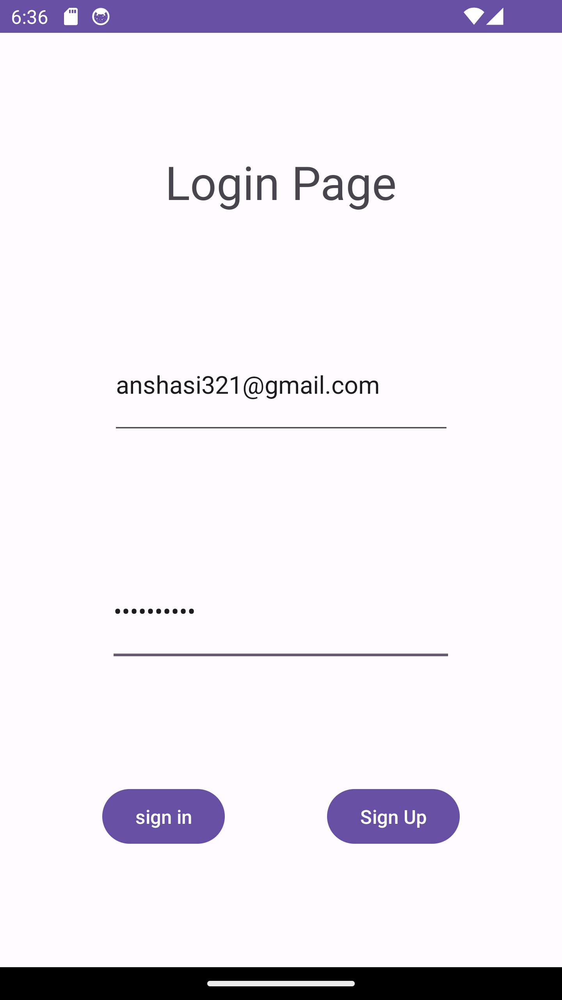

# for lab 26
### i add 3 activity Home , add task ,all task

# for Lab 27 
### i add everything as recommended 
### from the settings you can add a username and see it in the home page
### from study , todo , go work. you can open the detail page
# all images

# for Lab 28
### Now you can click on the Recyclerview Tasks and take you to the detail page and see it there  

# for Lab 29
### Now you can add task in Add Task activity with  

- title
- body
- data created 
- stateoftask   

 it will save them in task entity
### and you can see them in main activity and Browse them in details page.

 

# Lab 31 
we make some espresso tests.

# lab 32 
the add task become connected with DynamoDB.
the recyclerview become retrieve data from DynamoDB.
the espresso still working fine.

---

# Lab 33
* I made all the requirements
* now you can add a task and select the team you want
* **and from setting page you can manipulate which Team to display on the main-activity**
* Default TeamOne in the main page
* i modified the Espresso
* also you can see the name on task details

# Lab 34
* I made all the requirements
* now you can edit the Name and Body of the Task by click on it from recycle view
* I have created a new page called Edit
* you can also Delete the Task

# Lab 36
* I made all the requirements
* i have added 3 new activity login sign_up sign_in
  
  
  
  
* if the user  isn't login  he will se button to log-in otherwise would see log_out and his email

 
 

