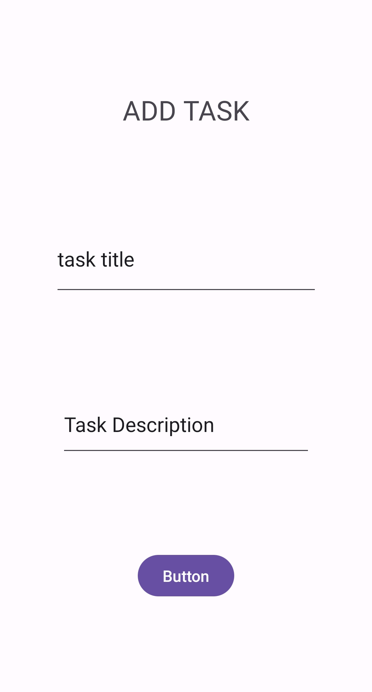

# for lab 26
### i add 3 activity Home , add task ,all task

# for Lab 27 
### i add everything as recommended 
### from the settings you can add a username and see it in the home page
### from study , todo , go work. you can open the detail page
# all images

# for Lab 28
### Now you can click on the Recyclerview Tasks and take you to the detail page and see it there  

